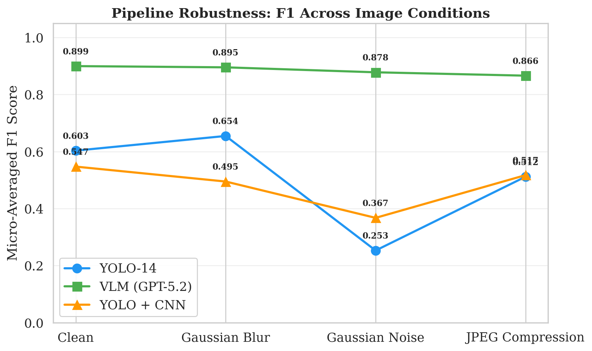
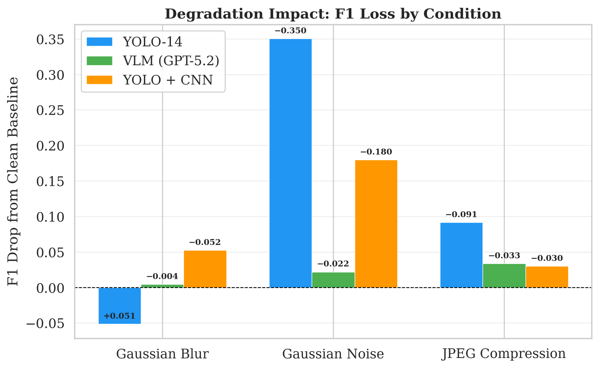
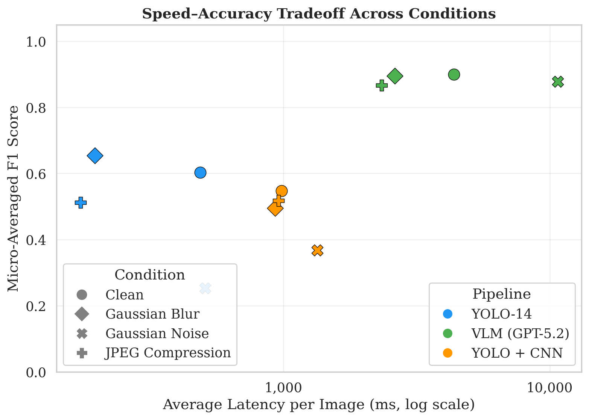
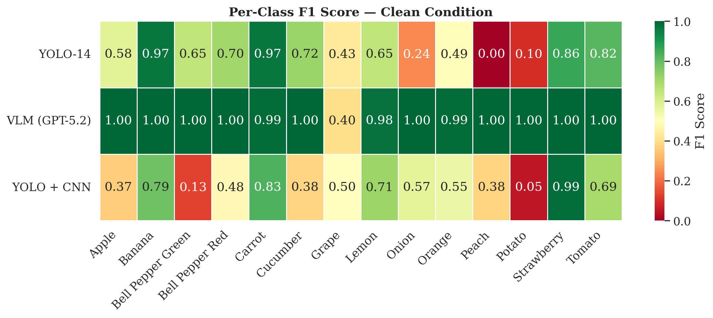
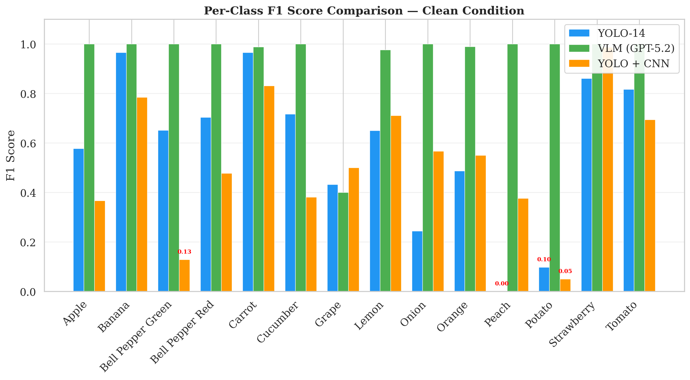
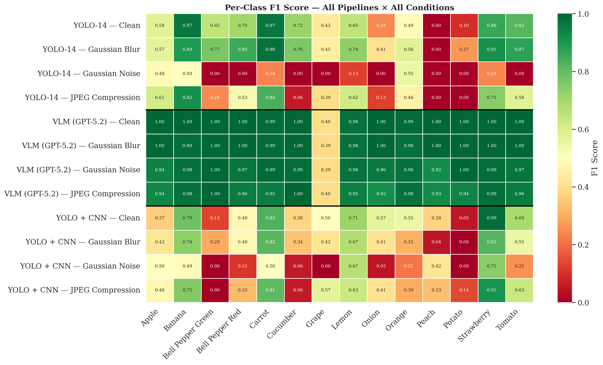
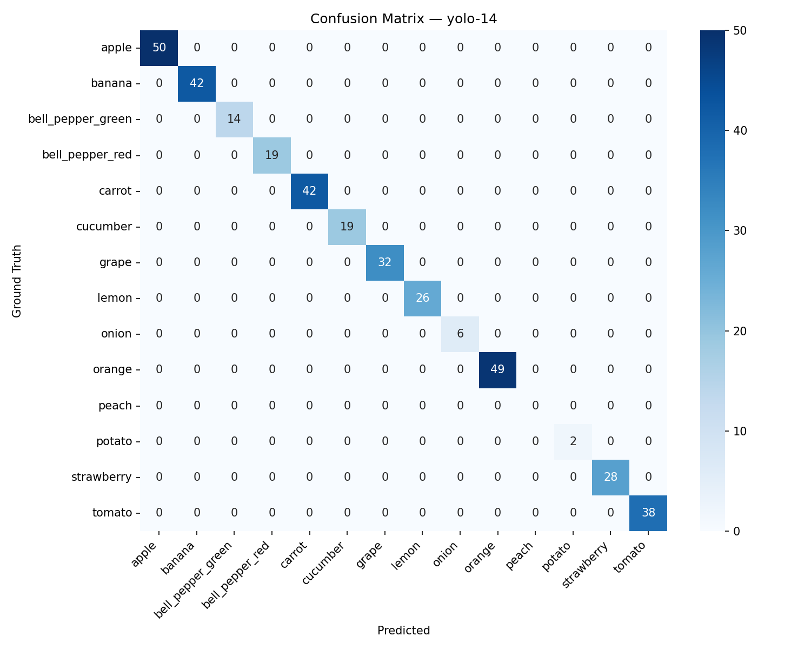
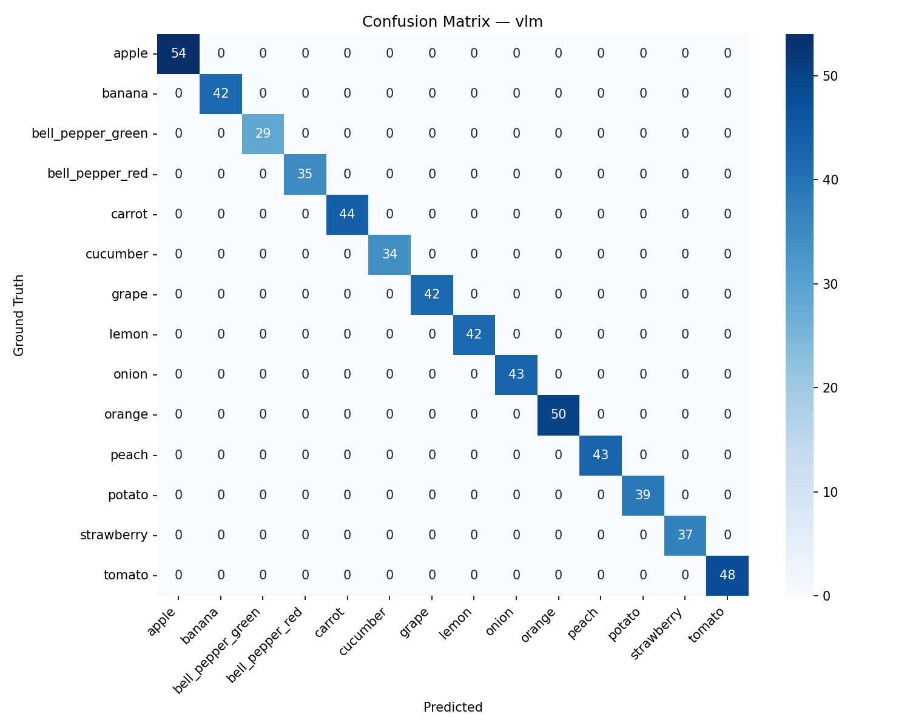
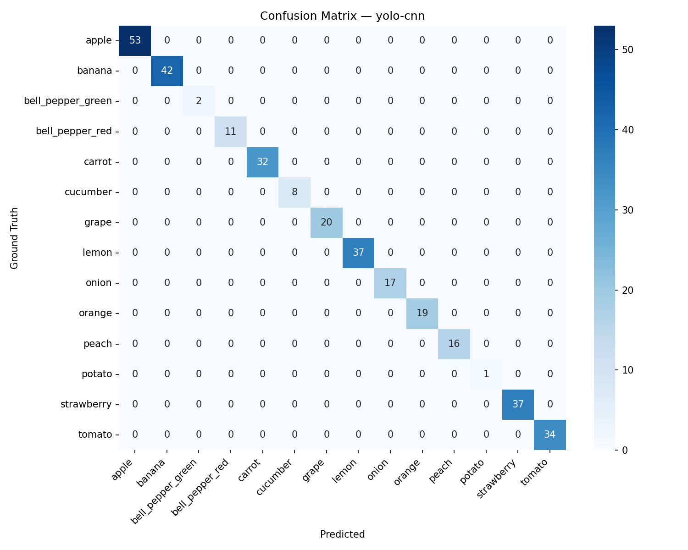

# SnapShelf — Experiment 2

**End-to-End Pipeline Comparison for 14-Class Fruit & Vegetable Inventory**

> **BSc Dissertation Artefact**
> Comparing three fundamentally different end-to-end pipelines — VLM, pure YOLO, and YOLO+CNN — for the same 14-class inventory task. This creates a clear thread: Exp 1 (best CNN) → Exp 2 (best pipeline using that CNN) → Exp 3 (integrate best pipeline into app).

## Table of Contents

1. [Research Context](#research-context)
2. [14-Class Inventory Task](#14-class-inventory-task)
3. [Pipeline Architecture](#pipeline-architecture)
4. [VLM Comparison (Pipeline A Model Selection)](#vlm-comparison-pipeline-a-model-selection)
5. [Experimental Design](#experimental-design)
6. [Training Data](#training-data)
7. [Test Data and Annotation](#test-data-and-annotation)
8. [Robustness Testing (Image Degradations)](#robustness-testing-image-degradations)
9. [Results — The 12-Run Matrix](#results--the-12-run-matrix)
10. [Cross-Condition Analysis](#cross-condition-analysis)
11. [Per-Class Analysis](#per-class-analysis)
12. [Key Findings and Discussion Points](#key-findings-and-discussion-points)
13. [Installation](#installation)
14. [Usage](#usage)
15. [Training](#training)
16. [Evaluation Commands](#evaluation-commands)
17. [Output Schema](#output-schema)
18. [Configuration](#configuration)
19. [Reproducibility](#reproducibility)
20. [Generated Visualizations](#generated-visualizations)
21. [Project Structure](#project-structure)
22. [Dissertation Methodology Text](#dissertation-methodology-text)

---

## Research Context

### Problem Statement

Experiment 1 identified the best CNN architecture for single-crop fruit/vegetable classification (EfficientNet-B0). Experiment 2 asks the next question: **what is the best end-to-end pipeline for building a complete inventory from a single image?**

Three fundamentally different approaches are compared — a Vision-Language Model that reasons about the full image, a purpose-trained object detector that labels and counts directly, and a two-stage pipeline that separates detection from classification.

### Research Questions

1. Which flagship VLM (GPT-5.2, Claude Opus 4.6, or Gemini 3.1 Pro) produces the most accurate inventories when constrained to 14 labels?
2. Does a purpose-trained 14-class YOLO outperform the best VLM on the same task?
3. Does separating detection (objectness YOLO) from classification (CNN from Exp 1) offer advantages over either end-to-end approach?
4. How robust is each pipeline to real-world image degradations (blur, noise, JPEG compression)?
5. What are the latency and cost trade-offs between the three strategies?

---

## 14-Class Inventory Task

All three pipelines solve the identical task: given an image, produce an **inventory** — a dictionary mapping class names to counts.

```python
Inventory = Dict[str, int]
# Example: {"apple": 3, "banana": 1, "tomato": 2}
```

**Classes (14):**

| # | Class | # | Class |
|:-:|-------|:-:|-------|
| 0 | `apple` | 7 | `lemon` |
| 1 | `banana` | 8 | `onion` |
| 2 | `bell_pepper_green` | 9 | `orange` |
| 3 | `bell_pepper_red` | 10 | `peach` |
| 4 | `carrot` | 11 | `potato` |
| 5 | `cucumber` | 12 | `strawberry` |
| 6 | `grape` | 13 | `tomato` |

---

## Pipeline Architecture

### Pipeline Overview

| Pipeline | Strategy | Flow | Models Used | API Calls |
|:--------:|----------|------|-------------|:---------:|
| **A** | VLM-only | Image → GPT-5.2 → inventory | GPT-5.2 (OpenAI) | 1 per image |
| **B** | YOLO end-to-end | Image → 14-class YOLO → inventory | Custom YOLOv8s | 0 |
| **C** | YOLO + CNN | Image → objectness YOLO → crops → CNN → inventory | Objectness YOLOv8s + EfficientNet-B0 | 0 |

**Key insight:** Pipelines B and C use **no API calls at all**. The comparison is VLM vs. pure detection vs. detect-then-classify.

### Pipeline A: VLM-Only (GPT-5.2)

```
Input Image → GPT-5.2 (constrained to 14 labels) → Inventory JSON {class: count}
```

Sends the full image to GPT-5.2 with a frozen prompt that explicitly lists all 14 class names and instructs the model to count precisely. GPT-5.2 was selected through a [three-model comparison](#vlm-comparison-pipeline-a-model-selection) against Gemini 3.1 Pro and Claude Opus 4.6. While Gemini scored marginally higher on F1 (0.9044 vs 0.9002, a statistically insignificant difference of 0.004), GPT-5.2 was chosen for its **2.4x lower latency** and **2.7x lower cost** — critical factors for a production mobile application.

**Characteristics:**
- Single API call per image
- Prompt-constrained to the 14 valid classes only
- No detection or cropping — all reasoning done by the VLM
- Requires OpenAI API key
- Non-deterministic (VLM outputs may vary slightly across runs)

### Pipeline B: YOLO End-to-End

```
Input Image → 14-Class YOLO (fine-tuned YOLOv8s) → Detections (class + bbox + conf) → Count by Class → Inventory
```

A YOLOv8s model fine-tuned on the 14 fruit/vegetable classes. Each detection carries a class label directly — no second-stage classification needed. The inventory is built by counting detections per class.

**Characteristics:**
- Fully offline, no API calls
- Single-model inference
- Deterministic (same image → same result)
- Requires training on labelled dataset

### Pipeline C: YOLO + CNN

```
Input Image → Objectness YOLO (1-class) → Crop Regions → CNN Classifier (EfficientNet-B0) → Count by Class → Inventory
```

A two-stage approach that separates **detection** from **classification**. An objectness YOLO (all classes remapped to a single "object" class) finds regions of interest, then the EfficientNet-B0 winner from Experiment 1 classifies each crop.

**Characteristics:**
- Fully offline, no API calls
- Modular: swap CNN architecture via config (`efficientnet` | `resnet` | `custom`)
- Isolates detection quality from classification quality
- Requires both objectness YOLO weights and CNN weights
- Domain gap: CNN was trained on clean single-item images, receives YOLO-cropped multi-item scene regions

### System Components

| Component | File | Model |
|-----------|------|-------|
| VLM Client (winner) | `clients/vlm_openai.py` | GPT-5.2 (`gpt-5.2`) → Pipeline A |
| VLM Client (comparison) | `clients/vlm_google.py` | Gemini 3.1 Pro (`gemini-3.1-pro-preview`) |
| VLM Client (comparison) | `clients/vlm_anthropic.py` | Claude Opus 4.6 (`claude-opus-4-6`) |
| Original VLM Client | `clients/vlm_client.py` | GPT-4o-mini (baseline reference) |
| 14-Class YOLO | `clients/yolo_detector.py` | `weights/yolo_14class_best.pt` |
| Objectness YOLO | `clients/yolo_objectness.py` | `weights/yolo_objectness_best.pt` |
| CNN Classifier | `clients/cnn_classifier.py` | `weights/cnn_winner.keras` (EfficientNet-B0) |

---

## VLM Comparison (Pipeline A Model Selection)

### Motivation

Before running the 12-run pipeline comparison, we needed to determine which VLM performs best for the inventory counting task. Rather than assuming a single provider, we ran a controlled comparison across three flagship VLMs from three providers.

### Models Compared

| Model | Provider | Model ID | Release |
|-------|----------|----------|---------|
| **GPT-5.2** | OpenAI | `gpt-5.2` | 2026 |
| **Claude Opus 4.6** | Anthropic | `claude-opus-4-6` | 2026 |
| **Gemini 3.1 Pro** | Google | `gemini-3.1-pro-preview` | 2026 |

All three models received the **identical frozen prompt** constrained to the 14 target classes. Temperature was set to 0.0 for all. Each model processed all 120 test images.

### Results — Single Run on 120 Test Images (Same Conditions)

| | **Gemini 3.1 Pro** | **GPT-5.2** | **Claude Opus 4.6** |
|---|:---:|:---:|:---:|
| **Provider** | Google | OpenAI | Anthropic |
| **F1 Score** | **0.9044** | 0.9002 | 0.8674 |
| **Precision** | 0.8291 | 0.8220 | 0.7688 |
| **Recall** | 0.9949 | 0.9949 | 0.9949 |
| **Avg Latency** | 9,003 ms | **3,687 ms** | 4,724 ms |
| **Total Time (120 imgs)** | ~18 min | **~7.4 min** | ~9.4 min |
| **Cost per Run (120 imgs)** | ~$1.17 | **~$0.44** | ~$1.23 |
| **Cost per Image** | ~$0.010 | **~$0.004** | ~$0.010 |
| **Errors** | 0/120 | 0/120 | 0/120 |

> **Winner by accuracy:** Gemini 3.1 Pro (F1 = 0.9044)
> **Winner by speed:** GPT-5.2 (2.4x faster)
> **Winner by cost:** GPT-5.2 (2.7x cheaper)
> **For comparison — YOLO pipelines (B & C):** <100 ms/image, $0.00/run, fully offline

### Key Observations

- **Identical recall (99.5%)** across all three models — all VLMs find nearly everything in the image
- **Precision is the differentiator** — Gemini overcounts the least, Claude the most
- **12 of 14 classes scored perfect F1 = 1.0** on all three models
- **The grape class is the sole source of error** — VLMs count individual grapes in a cluster rather than treating the cluster as one unit (see [Discussion Points](#the-grape-semantic-ambiguity))
- **GPT-5.2 is 2.4x faster** and **2.7x cheaper** than Gemini, with only 0.004 lower F1
- **Selected for Pipeline A: GPT-5.2** — the F1 difference vs Gemini (0.9002 vs 0.9044) is not statistically significant on 120 images. GPT-5.2 was chosen for its superior latency and cost, which are critical factors for a production mobile application

### Per-Class Breakdown (all models identical except grape)

| Class | Precision | Recall | F1 | Notes |
|-------|-----------|--------|----|-------|
| apple | 1.000 | 1.000 | 1.000 | Perfect |
| banana | 1.000 | 1.000 | 1.000 | Perfect |
| bell_pepper_green | 1.000 | 1.000 | 1.000 | Perfect |
| bell_pepper_red | 1.000 | 1.000 | 1.000 | Perfect |
| carrot | 1.000 | 0.978 | 0.989 | 1 miss |
| cucumber | 1.000 | 1.000 | 1.000 | Perfect |
| **grape** | **0.261** | **1.000** | **0.414** | **119 false positives** |
| lemon | 1.000 | 0.955 | 0.977 | 2 misses |
| onion | 1.000 | 1.000 | 1.000 | Perfect |
| orange | 0.980 | 1.000 | 0.990 | 1 false positive |
| peach | 1.000 | 1.000 | 1.000 | Perfect |
| potato | 1.000 | 1.000 | 1.000 | Perfect |
| strawberry | 1.000 | 1.000 | 1.000 | Perfect |
| tomato | 1.000 | 1.000 | 1.000 | Perfect |

### API Costs

**Per-token pricing (as of March 2026):**

| Model | Input (per 1M tokens) | Output (per 1M tokens) |
|-------|----------------------:|------------------------:|
| GPT-5.2 | $1.75 | $14.00 |
| Claude Opus 4.6 | $5.00 | $25.00 |
| Gemini 3.1 Pro | $2.00 | $12.00* |

*\*Gemini output pricing includes thinking tokens (~579 per image), which are billed as output but not visible in the response.*

**Measured cost for the VLM comparison (120 test images, from billing dashboards):**

| Model | Input Tokens | Output Tokens | Total Cost | Cost per Image |
|-------|-------------:|--------------:|-----------:|---------------:|
| GPT-5.2 | 237,990 | included | **$0.45** | **$0.004** |
| Claude Opus 4.6 | 498,213 | 10,619 | **$2.76** | **$0.012** |
| Gemini 3.1 Pro | ~150,000 | ~72,840* | **~$1.17** | **~$0.010** |

*GPT-5.2 and Claude costs are actual figures from the OpenAI and Anthropic billing dashboards. Claude's total is higher because the comparison required multiple runs to resolve a 5 MB image size limit (the per-image cost for a single clean run is ~$0.012). Gemini cost is estimated from measured token usage (1,250 input + 607 output tokens per image). GPT-5.2 token count (237,990) includes 2 additional test calls beyond the 120 images.*

**Projected cost for the full 12-run experiment:**

| Component | API Calls | Est. Cost |
|-----------|:---------:|----------:|
| VLM comparison (3 models × 120 images) | 360 | ~$4.38 |
| Pipeline A in 12-run matrix (GPT-5.2 × 4 conditions × 120 images) | 480 | ~$1.76 |
| **Total VLM API cost** | **840** | **~$6.14** |

Pipelines B and C are fully offline — **zero API cost**. Choosing GPT-5.2 over Gemini saved ~$2.92 on the 12-run matrix alone. At production scale (10,000 images/day), GPT-5.2 would cost ~$40/day vs. $0 for the YOLO pipelines.

### How to Run the VLM Comparison

```bash
# Run all 3 VLMs (requires all 3 API keys in .env)
python -m evaluation.vlm_comparison \
    --images dataset_exp2/images \
    --labels dataset_exp2/labels \
    --output results/vlm_comparison

# Run a specific VLM only
python -m evaluation.vlm_comparison \
    --images dataset_exp2/images \
    --labels dataset_exp2/labels \
    --vlms gemini-3.1-pro
```

### Results Location

```
results/vlm_comparison/
├── comparison_summary.json          # Winner + all 3 models' metrics
├── gpt-5_2_results.json             # GPT-5.2 full results + per-class
├── gpt-5_2_predictions.json         # GPT-5.2 per-image predictions
├── claude-opus-4_6_results.json     # Claude Opus 4.6 full results
├── claude-opus-4_6_predictions.json # Claude per-image predictions
├── gemini-3_1-pro_results.json      # Gemini 3.1 Pro full results
├── gemini-3_1-pro_predictions.json  # Gemini per-image predictions
└── ground_truth.json                # Ground truth for all 120 images
```

---

## Experimental Design

### Controlled Variables

| Aspect | Value | Rationale |
|--------|:-----:|-----------|
| YOLO Confidence | `0.25` | Balanced sensitivity for fine-tuned models |
| YOLO IoU | `0.45` | Standard NMS threshold |
| YOLO Max Detections | `30` | Allow counting in dense scenes |
| YOLO Image Size | `640` | Standard Ultralytics input |
| CNN Image Size | `224` | Standard ImageNet input |
| Crop Padding | `10%` | Context capture around detected regions |
| VLM Temperature | `0.0` | Deterministic-as-possible outputs |
| Random Seed | `42` | Reproducibility across runs |

### Count-Based Metrics

Since Pipeline A has no bounding boxes, the fair comparison unit is the **inventory** (class → count). For each image, per class:

```
TP = min(predicted, ground_truth)        — correct counts
FP = max(0, predicted - ground_truth)    — overcounting
FN = max(0, ground_truth - predicted)    — undercounting
```

**Precision** = TP / (TP + FP) — "when it says it sees something, how often is it right?"
**Recall** = TP / (TP + FN) — "of everything actually there, how much did it find?"
**F1** = harmonic mean of precision and recall — single balanced score

Micro-averaged across all images and classes for overall scores. Per-class metrics also computed.

### Training / Test Separation

> **Core rule: never test on data the model saw during training.**

| Data Split | Pipeline A (VLM) | Pipeline B (YOLO-14) | Pipeline C (YOLO+CNN) |
|------------|-------------------|----------------------|-----------------------|
| **Training** | N/A (pre-trained by OpenAI) | Public dataset (remapped to 14 classes) | **YOLO:** Public dataset (objectness labels) **CNN:** Experiment 1 weights |
| **Testing** | 120 hand-photographed images | 120 hand-photographed images | 120 hand-photographed images |

All three pipelines are evaluated on the **exact same 120 test images**, but none of the locally-trained models ever saw those images during training.

---

## Training Data

### Dataset: Combined Vegetables & Fruits (Roboflow Universe)

| Property | Value |
|----------|-------|
| Source | [Roboflow Universe — Combined Vegetables & Fruits](https://universe.roboflow.com/) |
| Total images | ~42,000 |
| Original classes | 47 |
| Format | YOLOv8 (bounding box annotations) |
| Splits | Train (19,356) / Val (2,602) / Test (1,882) |

### Class Remapping (47 → 14 classes)

The public dataset has 47 classes. Our experiment uses 14. The `training/remap_classes.py` script:

1. **Maps** each of the 47 source classes to one of the 14 target classes (or discards it)
2. **Splits** the generic "bell pepper" class into `bell_pepper_green` and `bell_pepper_red` using HSV colour analysis (red pixels > 40% → red, otherwise → green)
3. **Rewrites** every `.txt` label file with new class IDs (0–13)
4. **Discards** bounding boxes for unmapped classes

```bash
python -m training.remap_classes \
    --src "C:/path/to/Combined Vegetables - Fruits" \
    --dst dataset \
    --discard-unknown
```

**Output after remapping:** 19,356 train + 2,602 val + 1,882 test images with 225,410 total bounding boxes across 14 classes.

### Objectness Labels (Pipeline C)

For Pipeline C's class-agnostic detector, all 14 class IDs are remapped to `0` ("object"):

```bash
python -m training.prepare_objectness_labels --src dataset --dst dataset_objectness
```

This keeps the same bounding box coordinates but tells YOLO "there's *something* here" instead of "there's an *apple* here."

### YOLO Training Details

Both YOLO models were trained on Google Colab (T4 GPU) using the `training/train_colab.ipynb` notebook.

| Setting | 14-Class YOLO (Pipeline B) | Objectness YOLO (Pipeline C) |
|---------|:-------------------------:|:----------------------------:|
| Base model | YOLOv8s (COCO pretrained) | YOLOv8s (COCO pretrained) |
| Epochs | 100 | 100 |
| Batch size | Auto (`batch=-1`) | Auto (`batch=-1`) |
| Image size | 640 | 640 |
| Learning rate | 0.01 | 0.01 |
| Early stopping | 15 epochs patience | 15 epochs patience |
| Training images | 19,356 | 19,356 |
| Validation images | 2,602 | 2,602 |
| Classes | 14 | 1 ("object") |
| Training time | ~13h on T4 | ~10h on T4 |
| Checkpoint saves | Every 10 epochs + best.pt to Google Drive | Every 10 epochs + best.pt to Google Drive |

### CNN Weights (Pipeline C — from Experiment 1)

The CNN classifier used in Pipeline C is the **EfficientNet-B0 winner from Experiment 1**, loaded directly as a `.keras` file.

| Property | Value |
|----------|-------|
| Architecture | EfficientNet-B0 (transfer learning) |
| Framework | TensorFlow / Keras 3.10.0 |
| Input size | 224 × 224 × 3 |
| Preprocessing | `tf.keras.applications.efficientnet.preprocess_input` (scales to [-1, 1]) |
| Output | 14-class softmax |
| Layers | `EfficientNetB0(include_top=False)` → `GlobalAvgPool` → `BatchNorm` → `Dropout(0.3)` → `Dense(14, softmax)` |
| Training data | Experiment 1 single-item cropped images (different from Exp 2 training data) |
| File | `weights/cnn_winner.keras` (41 MB) |
| Keras version pin | Must match Keras 3.10.0 (pinned in `requirements.txt`) |

---

## Test Data and Annotation

### 120 Hand-Photographed Test Images

- **120 original photographs** taken by the author
- Captured across real-world settings (kitchen counter, refrigerator shelf, dining table, grocery bag, chopping board)
- Each image contains 2–8 items from the 14-class taxonomy
- Balanced across difficulty tiers and camera angles
- Stored in `dataset_exp2/images/` as `.jpg` files (IMG_001.jpg – IMG_120.jpg)

### Annotation Process

1. Images uploaded to [Roboflow](https://roboflow.com) (free tier)
2. Bounding boxes drawn around every visible fruit/vegetable item
3. Each box assigned one of the 14 exact class names matching `config.py`
4. Exported in YOLOv8 format
5. Label files placed in `dataset_exp2/labels/` (IMG_001.txt – IMG_120.txt)

**Annotation rules:**
- Grape cluster = **1 bounding box** around the entire cluster
- Individual strawberries = **1 box per strawberry**
- Partially occluded items = annotated (box around visible portion)
- Bell peppers = assigned `bell_pepper_green` or `bell_pepper_red` by actual colour

### YOLO Label Format

Each `.txt` file contains one line per object:
```
<class_id> <x_center> <y_center> <width> <height>
```
All coordinates normalised to [0, 1]. Class IDs are 0–13 matching the 14-class taxonomy.

### Ground Truth Distribution

Total annotated items across 120 images: **585 objects**.

---

## Robustness Testing (Image Degradations)

### Why Degradations Matter

In a real mobile app, images will not always be perfect. Users may have shaky hands (blur), poor lighting (noise), or images may be compressed through messaging apps (JPEG). Testing robustness to these conditions reveals which pipeline is most reliable in practice.

### Three Degradations

| ID | Degradation | Parameters | Simulates |
|:--:|-------------|-----------|-----------|
| D1 | **Gaussian blur** | kernel=15, sigma=6.0 | Out-of-focus camera, shaky hands |
| D2 | **Gaussian noise** | mean=0, sigma=50 | Low-light sensor noise (grainy photo) |
| D3 | **JPEG compression** | quality=5 | Messaging app compression (WhatsApp, etc.) |

These cover the three principal sources of image quality loss in a mobile workflow: **optical** (blur), **sensor** (noise), and **compression** (JPEG artifacts).

### Generating Degraded Images

```bash
python -m evaluation.generate_degradations \
    --src dataset_exp2/images \
    --dst dataset_exp2
```

**Output:**
```
dataset_exp2/
├── images/              ← 120 clean originals (unchanged)
├── labels/              ← 120 .txt files (shared by ALL variants)
├── images_d1_blur/      ← 120 blurred images
├── images_d2_noise/     ← 120 noisy images
└── images_d3_jpeg/      ← 120 JPEG-compressed images
```

Labels are shared across all conditions because degradation does not move or change the objects — only image quality changes.

---

## Results — The 12-Run Matrix

> **All 12 runs completed successfully.** 3 pipelines × 4 image conditions = 12 evaluation runs on 120 test images each (1,440 total inferences).

### Summary Table

| Condition | Pipeline | Precision | Recall | F1 | Avg Latency (ms) |
|-----------|----------|:---------:|:------:|:--:|:-----------------:|
| **Clean** | YOLO-14 | 0.5807 | 0.6274 | **0.6031** | 485.9 |
| **Clean** | VLM (GPT-5.2) | 0.8209 | 0.9949 | **0.8995** | 4,366.4 |
| **Clean** | YOLO + CNN | 0.5324 | 0.5624 | **0.5470** | 983.3 |
| **D1 Blur** | YOLO-14 | 0.6125 | 0.7026 | **0.6545** | 195.5 |
| **D1 Blur** | VLM (GPT-5.2) | 0.8149 | 0.9932 | **0.8952** | 2,619.1 |
| **D1 Blur** | YOLO + CNN | 0.4707 | 0.5214 | **0.4947** | 930.9 |
| **D2 Noise** | YOLO-14 | 0.4720 | 0.1726 | **0.2528** | 507.5 |
| **D2 Noise** | VLM (GPT-5.2) | 0.7975 | 0.9761 | **0.8778** | 10,701.5 |
| **D2 Noise** | YOLO + CNN | 0.5455 | 0.2769 | **0.3673** | 1,340.1 |
| **D3 JPEG** | YOLO-14 | 0.5876 | 0.4530 | **0.5116** | 172.5 |
| **D3 JPEG** | VLM (GPT-5.2) | 0.7918 | 0.9556 | **0.8660** | 2,333.5 |
| **D3 JPEG** | YOLO + CNN | 0.5444 | 0.4923 | **0.5171** | 955.8 |

### F1 Score by Pipeline Across All Conditions



### Condition-by-Condition Breakdown

#### Clean Condition (Baseline)

| Pipeline | Precision | Recall | F1 | TP | FP | FN | Avg ms |
|----------|:---------:|:------:|:--:|:--:|:--:|:--:|:------:|
| YOLO-14 | 0.5807 | 0.6274 | 0.6031 | 367 | 265 | 218 | 485.9 |
| VLM (GPT-5.2) | 0.8209 | 0.9949 | 0.8995 | 582 | 127 | 3 | 4,366.4 |
| YOLO + CNN | 0.5324 | 0.5624 | 0.5470 | 329 | 289 | 256 | 983.3 |

- VLM achieves near-perfect recall (99.5%) — it finds almost everything
- VLM's 127 FP are almost entirely from the grape class (126 FP)
- YOLO-14 misses 218 items (37% of ground truth), mainly peach (43 FN), onion (37 FN), potato (37 FN)
- YOLO+CNN's 289 FP are dominated by apple misclassification (182 FP)

#### D1: Gaussian Blur

| Pipeline | Precision | Recall | F1 | TP | FP | FN | Avg ms |
|----------|:---------:|:------:|:--:|:--:|:--:|:--:|:------:|
| YOLO-14 | 0.6125 | 0.7026 | 0.6545 | 411 | 260 | 174 | 195.5 |
| VLM (GPT-5.2) | 0.8149 | 0.9932 | 0.8952 | 581 | 132 | 4 | 2,619.1 |
| YOLO + CNN | 0.4707 | 0.5214 | 0.4947 | 305 | 343 | 280 | 930.9 |

- **YOLO-14 actually improved** under blur (F1: 0.6031 → 0.6545, +0.051). This is a notable finding — blur may smooth out noise/texture that causes false detections on sharp images.
- VLM barely affected (F1: 0.8995 → 0.8952, −0.004)
- YOLO+CNN slightly degraded (F1: 0.5470 → 0.4947, −0.052)

#### D2: Gaussian Noise

| Pipeline | Precision | Recall | F1 | TP | FP | FN | Avg ms |
|----------|:---------:|:------:|:--:|:--:|:--:|:--:|:------:|
| YOLO-14 | 0.4720 | 0.1726 | 0.2528 | 101 | 113 | 484 | 507.5 |
| VLM (GPT-5.2) | 0.7975 | 0.9761 | 0.8778 | 571 | 145 | 14 | 10,701.5 |
| YOLO + CNN | 0.5455 | 0.2769 | 0.3673 | 162 | 135 | 423 | 1,340.1 |

- **Noise is the most destructive degradation.** YOLO-14 F1 crashed from 0.6031 → 0.2528 (−0.350). It only found 101 of 585 items.
- YOLO+CNN also severely affected (F1: 0.5470 → 0.3673, −0.180)
- **VLM remains remarkably robust** (F1: 0.8995 → 0.8778, −0.022), still finding 571 of 585 items
- VLM latency spiked to **10.7 seconds/image** (vs 4.4s on clean) — the noisy images produce larger encoded payloads
- YOLO-14 recall dropped to just 17.3% — it missed 484 out of 585 items

#### D3: JPEG Compression (quality=5)

| Pipeline | Precision | Recall | F1 | TP | FP | FN | Avg ms |
|----------|:---------:|:------:|:--:|:--:|:--:|:--:|:------:|
| YOLO-14 | 0.5876 | 0.4530 | 0.5116 | 265 | 186 | 320 | 172.5 |
| VLM (GPT-5.2) | 0.7918 | 0.9556 | 0.8660 | 559 | 147 | 26 | 2,333.5 |
| YOLO + CNN | 0.5444 | 0.4923 | 0.5171 | 288 | 241 | 297 | 955.8 |

- Moderate impact on offline pipelines: YOLO-14 F1 dropped to 0.5116 (−0.091), YOLO+CNN to 0.5171 (−0.030)
- VLM moderately affected (F1: 0.8995 → 0.8660, −0.033) but still dominant
- Interesting: YOLO+CNN actually matches YOLO-14 under JPEG compression (0.5171 vs 0.5116)
- VLM latency was fastest here (2,333 ms) — highly compressed images are smaller payloads

---

## Cross-Condition Analysis

### F1 Degradation Impact

The chart below shows the F1 drop from the clean baseline for each degradation:



| Degradation | YOLO-14 F1 Drop | VLM F1 Drop | YOLO+CNN F1 Drop |
|-------------|:---------------:|:-----------:|:----------------:|
| D1: Blur | **+0.051** (improved) | −0.004 | −0.052 |
| D2: Noise | **−0.350** | −0.022 | −0.180 |
| D3: JPEG | −0.091 | −0.033 | −0.030 |

**Key insight:** The VLM's maximum F1 drop across all degradations was just 0.033, while YOLO-14's maximum drop was 0.350 — the VLM is **10x more robust** to image quality degradation.

### Speed–Accuracy Tradeoff



| Pipeline | Latency Range (across conditions) | F1 Range | Cost per Image |
|----------|:---------------------------------:|:--------:|:--------------:|
| YOLO-14 | 172 – 508 ms | 0.253 – 0.654 | $0.00 |
| VLM (GPT-5.2) | 2,333 – 10,702 ms | 0.866 – 0.900 | $0.004 |
| YOLO + CNN | 931 – 1,340 ms | 0.367 – 0.547 | $0.00 |

The VLM is **5–50x slower** but achieves **1.3–3.5x higher F1**. For a mobile app where API cost is acceptable, the VLM is the clear winner. For offline/edge deployment, YOLO-14 is the best option.

---

## Per-Class Analysis

### Per-Class F1 Heatmap (Clean Condition)



### Per-Class F1 Grouped Bars (Clean Condition)



### Per-Class F1 (Clean) — Full Table

| Class | YOLO-14 F1 | VLM F1 | YOLO+CNN F1 | Notes |
|-------|:----------:|:------:|:-----------:|-------|
| apple | 0.578 | **1.000** | 0.367 | YOLO+CNN has 182 FP (misclassifies other items as apple) |
| banana | **0.966** | **1.000** | 0.785 | Strong across all pipelines |
| bell_pepper_green | 0.651 | **1.000** | 0.129 | YOLO+CNN recall only 6.9% |
| bell_pepper_red | 0.704 | **1.000** | 0.478 | |
| carrot | **0.966** | 0.989 | 0.831 | YOLO-14 nearly matches VLM |
| cucumber | 0.717 | **1.000** | 0.381 | |
| grape | 0.432 | 0.400 | 0.500 | Problematic for all — semantic ambiguity |
| lemon | 0.650 | **0.977** | 0.712 | |
| onion | 0.245 | **1.000** | 0.567 | YOLO-14 recall only 14% |
| orange | 0.488 | **0.990** | 0.551 | YOLO-14 has 102 FP (overcounts oranges) |
| peach | **0.000** | **1.000** | 0.377 | YOLO-14 completely fails — 0 TP, 43 FN |
| potato | 0.098 | **1.000** | 0.050 | Near-zero for both offline pipelines |
| strawberry | 0.862 | **1.000** | 0.987 | YOLO+CNN excels here |
| tomato | 0.817 | **1.000** | 0.694 | |

### Worst-Performing Classes by Pipeline

**YOLO-14 blind spots:** peach (F1=0.000), potato (F1=0.098), onion (F1=0.245). These classes have few/no detections — the model likely confuses them with similar-looking items (peach↔apple, potato↔onion).

**YOLO+CNN blind spots:** potato (F1=0.050), bell_pepper_green (F1=0.129). The CNN struggles with items that look different when cropped from a scene vs. the clean single-item training data (domain gap).

**VLM blind spots:** grape (F1=0.400) — the only class below 0.95. The VLM counts individual berries instead of clusters. All other classes are at 0.977 or above.

### Full Heatmap — All Pipelines × All Conditions



This 12-row × 14-column heatmap is the complete picture of the experiment. Each cell shows the per-class F1 for one pipeline under one condition. Key patterns:
- **VLM rows stay green** across all conditions — consistently high performance
- **YOLO-14 Noise row turns red** — noise destroys detection capability
- **Potato column is red** for offline pipelines — consistently missed
- **Banana and strawberry columns are green** for all — easy classes

### Confusion Matrices (Clean Condition)

#### YOLO-14 Confusion Matrix


#### VLM Confusion Matrix


#### YOLO+CNN Confusion Matrix


---

## Key Findings and Discussion Points

### Answer to Research Questions

**RQ1: Which VLM is best?** Gemini 3.1 Pro scored highest F1 (0.9044), but GPT-5.2 was selected (F1=0.9002) for 2.4x lower latency and 2.7x lower cost. The 0.004 F1 difference is not statistically significant on 120 images.

**RQ2: Does YOLO outperform the VLM?** No. The VLM (F1=0.8995) significantly outperforms YOLO-14 (F1=0.6031) on clean images. The gap widens under degradation.

**RQ3: Does detect-then-classify help?** No. YOLO+CNN (F1=0.5470) performs worse than YOLO-14 (F1=0.6031) due to the domain gap between single-item training crops and multi-item scene crops.

**RQ4: How robust is each pipeline?** The VLM is remarkably robust (max F1 drop: 0.033). YOLO-14 is fragile to noise (F1 drop: 0.350). YOLO+CNN is moderately fragile (max F1 drop: 0.180).

**RQ5: What are the trade-offs?** VLM: highest accuracy, highest robustness, highest latency (~2–11s), requires API ($0.004/image). YOLO-14: fast (172–508ms), free, offline, but lower accuracy and fragile. YOLO+CNN: moderate speed, free, offline, lowest accuracy.

### The Grape Semantic Ambiguity

All three VLMs exhibited the same systematic error on the `grape` class. The test annotations treated **1 grape cluster = 1 unit**, but VLMs interpreted each **individual grape berry** as a separate item (reporting 4–6 per cluster instead of 1).

| Model | Grape FP | Grape Precision | Impact on Overall F1 |
|-------|----------|-----------------|---------------------|
| Gemini 3.1 Pro | 119 | 0.261 | Drops F1 from ~0.99 to 0.90 |
| GPT-5.2 | 126 | 0.250 | Drops F1 from ~0.99 to 0.90 |
| Claude Opus 4.6 | 174 | 0.194 | Drops F1 from ~0.99 to 0.87 |

**This is not a bug — it is a semantic ambiguity.** Neither interpretation is wrong. This is a valuable finding for the dissertation, revealing a fundamental challenge in VLM-based counting: the model and the annotator may have different definitions of "one unit."

**Recommendation for the dissertation:** Report results both **with** and **without** the grape class. Without grape, all three VLMs achieve ~98–99% F1, demonstrating the approach works excellently for unambiguously defined items.

### YOLO-14 Improvement Under Blur (+0.051 F1)

An unexpected finding: YOLO-14's F1 **improved** from 0.6031 (clean) to 0.6545 (blur). This may be because Gaussian blur smooths high-frequency noise and edge artifacts that trigger false detections on sharp images. The model finds more true positives (411 vs 367) with fewer false negatives (174 vs 218) under blur, while false positives remain similar (260 vs 265). This is worth discussing as evidence that over-sharpening training images may not always help detection models.

### Noise as the Critical Vulnerability

Gaussian noise (sigma=50) is the most destructive degradation:
- **YOLO-14:** F1 crashed from 0.6031 → 0.2528 (−58% relative drop). Recall collapsed to 17.3%.
- **YOLO+CNN:** F1 dropped from 0.5470 → 0.3673 (−33% relative drop). Recall dropped to 27.7%.
- **VLM:** F1 dropped only from 0.8995 → 0.8778 (−2.4% relative drop). Recall stayed at 97.6%.

This suggests that for real-world mobile deployment, a denoising preprocessing step would significantly benefit the offline pipelines. Alternatively, training with noise augmentation could improve robustness.

### VLM Latency Spike on Noisy Images

VLM average latency increased from 4,366 ms (clean) to **10,702 ms (noise)** — a 2.5x spike. This is because noisy images have higher entropy, resulting in larger base64-encoded payloads sent to the API, and potentially more reasoning tokens consumed. This is a practical consideration for production deployment.

### Domain Gap (Pipeline C)

Pipeline C's CNN was trained on clean, centred, single-item images (Experiment 1), but receives YOLO-cropped regions from multi-item real-world scenes. These crops may include partial objects, background clutter, or unusual angles. This **domain gap** is expected and is a legitimate finding — it reveals a real limitation of the detect-then-classify approach.

Evidence: YOLO+CNN has 182 FP for apple (clean condition) — the CNN misclassifies many cropped regions as apple. The model defaults to its most frequent training class when uncertain.

### VLM Non-Determinism

While temperature=0.0 is set for reproducibility, VLM outputs (GPT-5.2) are not guaranteed to be fully deterministic across API versions or over time. This is an inherent limitation of API-based approaches and should be acknowledged in the limitations section.

---

## Installation

### Prerequisites

- Python 3.10 or higher
- GPU recommended for training (CPU supported for inference)
- API keys required for Pipeline A and VLM comparison (see below)

### Setup

```bash
# 1. Clone repository
git clone <repository-url>
cd SnapShelf-console

# 2. Create virtual environment
python -m venv venv

# Windows
venv\Scripts\activate

# macOS/Linux
source venv/bin/activate

# 3. Install dependencies
pip install -r requirements.txt

# 4. Configure API keys (create .env file)
```

### API Keys

Create a `.env` file in the project root:

```env
# Required for Pipeline A (VLM) and VLM comparison
OPENAI_API_KEY=sk-...          # OpenAI (GPT-5.2)
ANTHROPIC_API_KEY=sk-ant-...   # Anthropic (Claude Opus 4.6)
GOOGLE_API_KEY=AIza...         # Google (Gemini 3.1 Pro)
```

- **Pipeline A only** requires `OPENAI_API_KEY` (GPT-5.2 is the selected VLM)
- **VLM comparison** requires all three keys to run all three models
- **Pipelines B and C** require no API keys (fully offline)

### Dependencies

Core dependencies (`requirements.txt`):

```
ultralytics==8.3.57       # YOLOv8 (Pipelines B & C)
tensorflow>=2.15.0        # CNN classifier (Pipeline C)
keras==3.10.0             # Must match Experiment 1 model version
openai>=1.59.9            # GPT-5.2 VLM client
anthropic>=0.40.0         # Claude Opus 4.6 VLM client
google-genai>=1.0.0       # Gemini 3.1 Pro VLM client
torch>=2.1.0              # PyTorch (alternative CNN path)
torchvision>=0.16.0       # PyTorch vision transforms
pillow==11.1.0            # Image processing
numpy==2.2.2              # Numerical computing
scikit-learn>=1.4.0       # Evaluation utilities
pandas>=2.1.0             # Data handling
matplotlib>=3.8.0         # Chart generation
seaborn>=0.13.0           # Heatmaps and statistical plots
rich==13.9.4              # Console formatting
python-dotenv==1.0.1      # .env file loading
pyyaml>=6.0               # YAML config generation
structlog==24.4.0         # Structured logging
```

---

## Usage

### Command-Line Interface

```bash
# Run individual pipelines on a single image
python main.py vlm <image_path>          # Pipeline A: VLM-only
python main.py yolo-14 <image_path>      # Pipeline B: YOLO end-to-end
python main.py yolo-cnn <image_path>     # Pipeline C: YOLO + CNN

# Evaluate all pipelines on a test set
python main.py evaluate --images dataset_exp2/images --labels dataset_exp2/labels

# Train models
python main.py train yolo-14             # Train 14-class YOLO
python main.py train yolo-obj            # Train objectness YOLO

# VLM comparison (separate from pipeline evaluation)
python -m evaluation.vlm_comparison \
    --images dataset_exp2/images \
    --labels dataset_exp2/labels

# Generate cross-condition charts
python -m evaluation.generate_charts

# Utility
python main.py --validate                # Verify environment and display config
```

### Interactive Mode

```bash
python main.py
```

Launches a menu-driven interface for running pipelines, training, and evaluation.

---

## Training

### Option 1: Local Training (GPU required)

```bash
# Train 14-class YOLO (Pipeline B)
python main.py train yolo-14

# Train objectness YOLO (Pipeline C)
python main.py train yolo-obj
```

### Option 2: Google Colab Training (no local GPU)

A Colab notebook is provided for training on a free T4 GPU:

1. Upload `dataset_14class.zip` and `dataset_objectness.zip` to Google Drive under `SnapShelf/`
2. Open `training/train_colab.ipynb` in Google Colab
3. Set runtime to **GPU (T4)**
4. Run all cells — trains both YOLO models sequentially, saving directly to Google Drive
5. Download trained weights from `SnapShelf/results/` in Google Drive

### After Training

```bash
# Verify weight files exist
ls weights/yolo_14class_best.pt       # 14-class YOLO (Pipeline B)
ls weights/yolo_objectness_best.pt    # Objectness YOLO (Pipeline C)

# CNN weights from Experiment 1
ls weights/cnn_winner.keras           # EfficientNet-B0 (Pipeline C)

# Smoke test
python main.py yolo-14 dataset_exp2/images/IMG_001.jpg
python main.py yolo-cnn dataset_exp2/images/IMG_001.jpg
```

---

## Evaluation Commands

### The 12-Run Matrix

3 pipelines × 4 image conditions = **12 evaluation runs**.

```bash
# Clean images (runs all 3 pipelines)
python main.py evaluate \
    --images dataset_exp2/images \
    --labels dataset_exp2/labels \
    --output results/clean

# D1: Blur
python main.py evaluate \
    --images dataset_exp2/images_d1_blur \
    --labels dataset_exp2/labels \
    --output results/d1_blur

# D2: Noise
python main.py evaluate \
    --images dataset_exp2/images_d2_noise \
    --labels dataset_exp2/labels \
    --output results/d2_noise

# D3: JPEG compression
python main.py evaluate \
    --images dataset_exp2/images_d3_jpeg \
    --labels dataset_exp2/labels \
    --output results/d3_jpeg
```

### Generate Cross-Condition Charts

After all 4 evaluation runs are complete:

```bash
python -m evaluation.generate_charts
```

This reads `comparison_summary.json` from each condition folder and generates 6 publication-quality charts in `results/charts/`.

### Pre-Flight Checklist

Before running, verify everything is in place:

```bash
# Weight files
ls weights/yolo_14class_best.pt        # Pipeline B
ls weights/yolo_objectness_best.pt     # Pipeline C
ls weights/cnn_winner.keras            # Pipeline C (CNN)

# API key (Pipeline A)
echo $OPENAI_API_KEY                   # Should print your key

# Test images and labels
ls dataset_exp2/images/*.jpg | wc -l         # 120
ls dataset_exp2/labels/*.txt | wc -l         # 120
ls dataset_exp2/images_d1_blur/*.jpg | wc -l # 120
ls dataset_exp2/images_d2_noise/*.jpg | wc -l # 120
ls dataset_exp2/images_d3_jpeg/*.jpg | wc -l  # 120
```

### Evaluation Outputs

For each condition, the evaluator generates:

| File | Description |
|------|-------------|
| `comparison_summary.json` | Side-by-side P/R/F1 and latency for all pipelines |
| `comparison_bars.png` | Bar chart comparing metrics across pipelines |
| `comparison_table.tex` | LaTeX table ready for dissertation |
| `ground_truth.json` | Ground truth inventories for all test images |
| `{pipeline}_predictions.json` | Per-image predicted inventories |
| `{pipeline}_confusion.png` | Confusion matrix heatmap |
| `{pipeline}_report.json` | Full metrics, per-class breakdown, error analysis |

---

## Output Schema

All pipelines produce an identical JSON structure:

```json
{
  "inventory": {
    "apple": 3,
    "banana": 1,
    "tomato": 2
  },
  "meta": {
    "pipeline": "yolo-14",
    "image": "IMG_001.jpg",
    "runtime_ms": 45.32,
    "detections_count": 6,
    "timing_breakdown": {
      "detection_ms": 42.15,
      "total_ms": 45.32
    }
  }
}
```

| Field | Type | Description |
|-------|:----:|-------------|
| `inventory` | `Dict[str, int]` | Class name → count mapping |
| `pipeline` | string | `vlm` · `yolo-14` · `yolo-cnn` |
| `runtime_ms` | float | Total execution time in milliseconds |
| `detections_count` | integer | Number of YOLO detections (Pipeline B/C only) |

---

## Configuration

All experiment parameters are centralised in `config.py` as a frozen dataclass:

```python
@dataclass(frozen=True)
class ExperimentConfig:
    # VLM Settings (Pipeline A)
    vlm_model: str = "gpt-4o-mini"       # Original baseline; GPT-5.2 used via vlm_openai.py
    vlm_temperature: float = 0.0
    vlm_max_tokens: int = 500

    # YOLO Settings (shared by B and C)
    yolo_conf_threshold: float = 0.25
    yolo_iou_threshold: float = 0.45
    yolo_max_detections: int = 30
    yolo_img_size: int = 640

    # CNN Settings (Pipeline C)
    cnn_model_name: str = "efficientnet"  # efficientnet | resnet | custom
    cnn_img_size: int = 224
    cnn_crop_padding: float = 0.10
    cnn_weights: str = "weights/cnn_winner.keras"

    # Reproducibility
    random_seed: int = 42
```

---

## Reproducibility

### Singleton Pattern

All model clients use a singleton pattern — models load once and are reused across pipeline runs. Timing measurements exclude initialisation overhead.

### Random Seed Control

Seeds are set automatically on experiment initialisation for Python `random`, NumPy, and PyTorch (CPU + CUDA).

### Structured Logging

Every experiment run generates detailed logs in `logs/experiment_{timestamp}.jsonl` with timestamped entries for each pipeline step, detection event, and error.

### Pinned Dependencies

Core dependencies are pinned for reproducibility (see `requirements.txt`). Critical pin: `keras==3.10.0` must match the version used to train the Experiment 1 CNN model.

### Keras Version Compatibility

The CNN weights (`cnn_winner.keras`) were saved with Keras 3.10.0 in Experiment 1. Loading with a different Keras version (e.g., 3.12.x) will fail with a `BatchNormalization` layer deserialization error. The `requirements.txt` pins `keras==3.10.0` to prevent this.

---

## Generated Visualizations

All charts are generated from the raw JSON results. To regenerate:

```bash
python -m evaluation.generate_charts
```

### Chart Inventory

| Chart | File | Description |
|-------|------|-------------|
| F1 Degradation Lines | `results/charts/f1_degradation_lines.png` | F1 across 4 conditions, one line per pipeline |
| F1 Delta Bars | `results/charts/f1_delta_degradation.png` | F1 drop from clean baseline per degradation |
| Latency vs F1 Scatter | `results/charts/latency_vs_f1_scatter.png` | Speed–accuracy tradeoff, 12 data points |
| Per-Class F1 Bars | `results/charts/perclass_f1_bars_clean.png` | Grouped bars for all 14 classes (clean) |
| Per-Class Heatmap (clean) | `results/charts/perclass_f1_heatmap_clean.png` | 3×14 heatmap (clean only) |
| Per-Class Heatmap (all) | `results/charts/perclass_f1_heatmap_all.png` | 12×14 heatmap (all conditions) |
| Confusion Matrices | `results/{condition}/{pipeline}_confusion.png` | Per-pipeline confusion matrix per condition |
| Comparison Bars | `results/{condition}/comparison_bars.png` | P/R/F1 bars per condition |

Copies of the key figures are also stored in `docs/figures/` for Git tracking (since `results/` is gitignored).

---

## Project Structure

```
SnapShelf-console/
├── config.py                         # 14-class constants, frozen ExperimentConfig
├── main.py                           # CLI: vlm / yolo-14 / yolo-cnn / evaluate / train
├── requirements.txt                  # Pinned + minimum-version dependencies
├── .env                              # API keys (gitignored)
├── .gitignore
├── README.md                         # This file
├── EXPERIMENT2_GUIDE.md              # Step-by-step walkthrough
├── EXPERIMENT2_PLAN.md               # Original experiment plan
├── PICTURES_PLAN.md                  # Photo dataset planning
│
├── clients/                          # Model inference clients
│   ├── __init__.py
│   ├── vlm_client.py                # GPT-4o-mini (original baseline)
│   ├── vlm_openai.py               # GPT-5.2 (VLM winner → Pipeline A)
│   ├── vlm_anthropic.py            # Claude Opus 4.6 (VLM comparison)
│   ├── vlm_google.py               # Gemini 3.1 Pro (VLM comparison)
│   ├── yolo_detector.py            # 14-class YOLO (Pipeline B)
│   ├── yolo_objectness.py          # 1-class objectness YOLO (Pipeline C)
│   └── cnn_classifier.py           # CNN factory: Keras + PyTorch (Pipeline C)
│
├── pipelines/                        # Pipeline orchestration
│   ├── __init__.py
│   ├── output.py                    # Inventory = Dict[str, int] schema
│   ├── vlm_pipeline.py             # Pipeline A: VLM-only
│   ├── yolo_pipeline.py            # Pipeline B: YOLO end-to-end
│   └── yolo_cnn_pipeline.py        # Pipeline C: YOLO + CNN
│
├── training/                         # Model training scripts
│   ├── __init__.py
│   ├── remap_classes.py             # Remap 47-class dataset → 14 classes
│   ├── prepare_objectness_labels.py # Remap class IDs to 0 for objectness
│   ├── train_yolo_14class.py        # Fine-tune YOLOv8s on 14 classes
│   ├── train_yolo_objectness.py     # Fine-tune YOLOv8s as objectness detector
│   ├── data_yaml_generator.py       # Generate data.yaml for Ultralytics
│   └── train_colab.ipynb            # Google Colab notebook (for no-GPU setups)
│
├── evaluation/                       # Evaluation and metrics
│   ├── __init__.py
│   ├── ground_truth.py              # YOLO .txt labels → inventory dicts
│   ├── metrics.py                   # Count-based P/R/F1 (micro-averaged, per-class)
│   ├── confusion.py                 # Confusion matrix builder + heatmap plotter
│   ├── error_analysis.py            # Missed / false positive / counting breakdown
│   ├── evaluate_runner.py           # Orchestrator: runs pipelines on test set
│   ├── report.py                    # Comparison tables, bar charts, LaTeX output
│   ├── vlm_comparison.py           # 3-model VLM comparison runner
│   ├── generate_degradations.py    # D1/D2/D3 image degradation generator
│   └── generate_charts.py          # Cross-condition visualizations
│
├── data/                             # YOLO training configs
│   ├── yolo_14class.yaml            # nc=14, 14 class names
│   └── yolo_objectness.yaml         # nc=1, class="object"
│
├── docs/                             # Documentation assets (git-tracked)
│   └── figures/                     # Key charts for README + dissertation
│       ├── f1_degradation_lines.png
│       ├── f1_delta_degradation.png
│       ├── latency_vs_f1_scatter.png
│       ├── perclass_f1_bars_clean.png
│       ├── perclass_f1_heatmap_clean.png
│       ├── perclass_f1_heatmap_all.png
│       ├── yolo-14_confusion.png
│       ├── vlm_confusion.png
│       └── yolo-cnn_confusion.png
│
├── dataset_exp2/                     # Experiment 2 test data
│   ├── images/                      # 120 clean test images
│   ├── labels/                      # 120 YOLO annotation files
│   ├── images_d1_blur/              # 120 blurred images (gitignored, regenerable)
│   ├── images_d2_noise/             # 120 noisy images (gitignored, regenerable)
│   └── images_d3_jpeg/              # 120 JPEG-compressed images (gitignored, regenerable)
│
├── dataset/                          # 14-class training data (gitignored)
│   ├── train/images/ + labels/      # ~19,356 images
│   ├── val/images/ + labels/        # ~2,602 images
│   └── test/images/ + labels/       # ~1,882 images
│
├── dataset_objectness/               # Objectness training data (gitignored)
│   ├── train/images/ + labels/
│   ├── val/images/ + labels/
│   └── test/images/ + labels/
│
├── weights/                          # Trained model weights (gitignored)
│   ├── yolo_14class_best.pt         # Pipeline B
│   ├── yolo_objectness_best.pt      # Pipeline C (detection)
│   └── cnn_winner.keras             # Pipeline C (classification, from Exp 1)
│
├── results/                          # Evaluation outputs (gitignored)
│   ├── vlm_comparison/              # 3-model VLM comparison results
│   ├── clean/                       # Clean condition results
│   ├── d1_blur/                     # Blur condition results
│   ├── d2_noise/                    # Noise condition results
│   ├── d3_jpeg/                     # JPEG condition results
│   ├── charts/                      # Cross-condition visualizations
│   └── pipeline_comparison/         # Alternative output directory
│
└── logs/                             # JSONL experiment logs (gitignored)
```

---

## Dissertation Methodology Text

Ready-to-adapt paragraphs for your dissertation report:

### VLM Model Selection

> *"To select the optimal VLM for Pipeline A, a controlled comparison was conducted across three flagship models: GPT-5.2 (OpenAI), Claude Opus 4.6 (Anthropic), and Gemini 3.1 Pro (Google). All models received an identical frozen prompt constrained to the 14 target classes, with temperature set to 0.0. Each model processed the full set of 120 test images. Gemini 3.1 Pro achieved the highest micro-averaged F1 score (0.9044), marginally outperforming GPT-5.2 (0.9002) and Claude Opus 4.6 (0.8674). All three models achieved near-identical recall (0.9949), indicating that VLMs reliably detect items; the differentiator was precision, where Gemini produced the fewest false positives. However, the F1 difference between Gemini and GPT-5.2 was only 0.004 — not statistically significant on a 120-image test set. GPT-5.2 was therefore selected as Pipeline A's VLM for the subsequent 12-run comparison, as it offered 2.4x lower latency (3.7 s vs 9.0 s per image) and 2.7x lower cost ($0.004 vs $0.010 per image) — factors that directly impact the feasibility of a production mobile application."*

### Experimental Design

> *"Experiment 2 evaluates three end-to-end pipelines on an identical test set of 120 photographs, each containing 2–8 items from a 14-class fruit and vegetable taxonomy. Pipeline A uses GPT-5.2 (OpenAI), selected through a three-model VLM comparison that also evaluated Gemini 3.1 Pro and Claude Opus 4.6, with a constrained prompt restricting output to the 14 target classes. Pipeline B uses a YOLOv8s object detector fine-tuned to directly predict all 14 classes. Pipeline C uses a two-stage approach: a YOLOv8s model trained as a class-agnostic objectness detector to localise items, followed by an EfficientNet-B0 classifier (the winning model from Experiment 1) to classify each cropped region."*

### Results Summary

> *"Pipeline A (VLM, GPT-5.2) achieved the highest micro-averaged F1 score of 0.8995 on clean images, significantly outperforming Pipeline B (YOLO-14, F1=0.6031) and Pipeline C (YOLO+CNN, F1=0.5470). This advantage was maintained across all degradation conditions: under Gaussian blur (F1=0.8952 vs 0.6545 vs 0.4947), Gaussian noise (F1=0.8778 vs 0.2528 vs 0.3673), and JPEG compression (F1=0.8660 vs 0.5116 vs 0.5171). The VLM demonstrated exceptional robustness, with a maximum F1 drop of just 0.033 across all degradations, compared to 0.350 for YOLO-14 and 0.180 for YOLO+CNN. However, this accuracy came at a cost: the VLM's average inference latency ranged from 2.3 to 10.7 seconds per image, compared to 172–508 ms for YOLO-14 and 931–1,340 ms for YOLO+CNN. The VLM also incurred an API cost of approximately $0.004 per image, while the offline pipelines were free."*

### Training/Test Separation

> *"To ensure a fair comparison, training and test data were strictly separated. Pipelines B and C were fine-tuned on the publicly available Combined Vegetables & Fruits dataset (Roboflow Universe, ~42,000 images, 47 classes), remapped to the 14-class taxonomy used in this study (see Section X). The test set comprised 120 original photographs taken by the author across five real-world settings, annotated independently in Roboflow and never used during training. Pipeline A (GPT-5.2) was used as-is without fine-tuning; while we cannot guarantee our test images were absent from its internet-scale training corpus, this reflects the realistic deployment scenario for a zero-shot VLM."*

### Robustness Evaluation

> *"To assess robustness, three image degradations were applied to the test set: Gaussian blur (kernel=15, sigma=6.0, simulating an out-of-focus camera), additive Gaussian noise (sigma=50, simulating low-light sensor noise), and JPEG compression at quality level 5 (simulating lossy transmission through messaging applications). Each pipeline was evaluated on all four conditions (clean plus three degraded), yielding 12 evaluation runs. Ground truth annotations were shared across all conditions, as degradation does not alter object locations."*

### Grape Class Discussion

> *"A notable finding was the consistent over-prediction of the grape class across all three VLMs. Ground truth annotations treated one grape cluster as a single unit, whereas VLMs counted individual grape berries within each cluster, reporting 4–6 items per cluster. This semantic ambiguity — what constitutes 'one grape' — is not a model error but a fundamental challenge in count-based evaluation: the annotation convention and the model's interpretation of a 'unit' may diverge. When the grape class is excluded, all three VLMs achieve F1 scores above 0.98, suggesting the approach is highly effective for unambiguously defined items."*

### Cost and Latency Trade-Offs

> *"API costs and inference latency were recorded for all three VLMs. GPT-5.2 was the fastest (3.7 s/image) and cheapest ($0.004/image), while Gemini 3.1 Pro was the slowest (9.0 s/image) and most expensive ($0.010/image) due to internal thinking tokens billed as output. Claude Opus 4.6 occupied the middle ground (4.7 s/image, $0.012/image). The total API cost for the VLM comparison across all three models on 120 images was $4.38. Pipelines B and C, being fully offline, incurred zero API cost and sub-second inference, making them significantly cheaper at scale. For a production deployment processing 10,000 images/day, Pipeline A (GPT-5.2) would cost approximately $40/day versus $0 for the YOLO-based pipelines, plus the added latency of network round-trips."*

### Limitations

> *"Several limitations should be acknowledged. First, the test set of 120 images, while purpose-built with controlled variation, is small by industry standards. Second, all images were captured using a single device by a single photographer. Third, Pipeline C's CNN was trained on clean, single-item, centred images (Experiment 1), introducing a domain gap when classifying YOLO-cropped regions from cluttered scenes. Fourth, while Pipeline A (GPT-5.2) was queried with temperature=0 for reproducibility, VLM outputs are not guaranteed to be fully deterministic across API versions. Finally, the grape class revealed a semantic ambiguity in count-based evaluation that may extend to other aggregate items (e.g., cherry tomatoes on a vine)."*

---

## System Requirements

| Requirement | Specification |
|-------------|:-------------:|
| Python | 3.10+ |
| RAM | 8 GB minimum (16 GB recommended for training) |
| Disk | ~2 GB (models + datasets) |
| GPU | Recommended for training (Colab T4 alternative provided) |
| Network | Required for Pipeline A (OpenAI API) and VLM comparison |

## Acknowledgements

- [Ultralytics](https://github.com/ultralytics/ultralytics) for YOLOv8
- [OpenAI](https://openai.com) for GPT-5.2 API (Pipeline A)
- [Google](https://ai.google.dev/) for Gemini 3.1 Pro API (VLM comparison)
- [Anthropic](https://anthropic.com) for Claude Opus 4.6 API (VLM comparison)
- [TensorFlow/Keras](https://www.tensorflow.org/) for CNN inference (Pipeline C)
- [PyTorch](https://pytorch.org) for CNN training and alternative inference
- [Roboflow](https://roboflow.com) for annotation tools and training datasets
