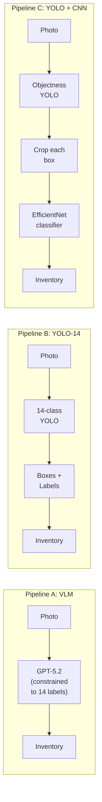
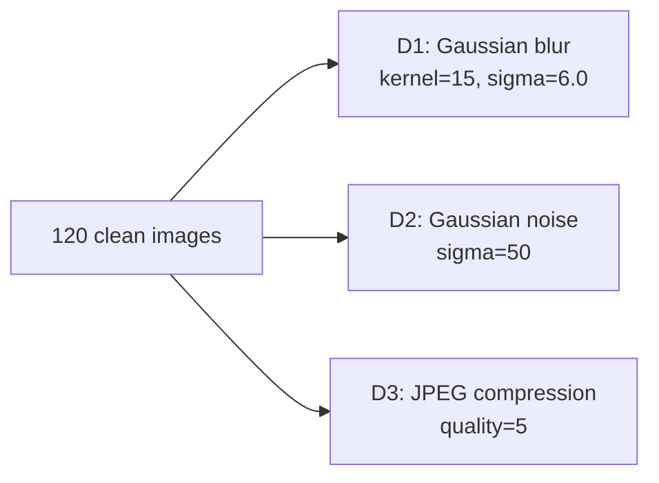

# Experiment 2: End-to-End Pipeline Comparison

**Module:** MOD002691 Computing Project
**Task:** Compare three pipelines for 14-class fruit/vegetable inventory from photos
**Selected pipeline:** VLM (GPT-5.2) with F1 = 0.900 on clean images

## Pipelines

Three fundamentally different approaches evaluated on the same 120-image test set and the same metrics.



| Pipeline | How it works | Weights |
|----------|-------------|---------|
| A (VLM) | Send image to GPT-5.2, parse structured output | API call, no local weights |
| B (YOLO-14) | 14-class YOLOv8s detection | `yolo_14class_best.pt` (22.5 MB) |
| C (YOLO+CNN) | 1-class objectness YOLOv8s + EfficientNetB0 classifier from [Exp 1](https://github.com/omorros/food-cv-exp1-cnn-comparison) | `yolo_objectness_best.pt` + `cnn_winner.keras` |

## VLM Model Selection (Pipeline A)

Three VLMs benchmarked on the clean test set before choosing one for Pipeline A.

| Model | F1 | Precision | Recall | Latency (ms/img) | Cost ($/img) |
|-------|-----|-----------|--------|-------------------|---------------|
| **GPT-5.2** | **0.900** | 0.822 | 0.995 | **3,687** | **0.004** |
| Gemini 3.1 Pro | 0.904 | 0.829 | 0.995 | 9,003 | 0.010 |
| Claude Opus 4.6 | 0.867 | 0.769 | 0.995 | 4,724 | 0.010 |

F1 difference between GPT-5.2 and Gemini is 0.004. GPT-5.2 selected for 2.4x lower latency and 2.7x lower cost.

## Test Data

120 photos taken in a home kitchen, each annotated with YOLO-format bounding boxes and mapped to the 14 classes.

To test robustness, three degradation conditions were generated from the same 120 originals:



This produces a 12-run matrix: 3 pipelines x 4 conditions (clean + 3 degradations).

## Results

### F1 Scores (12-run matrix)

| Condition | VLM | YOLO-14 | YOLO+CNN |
|-----------|-----|---------|----------|
| Clean | **0.900** | 0.603 | 0.547 |
| D1 Blur | **0.895** | 0.655 | 0.495 |
| D2 Noise | **0.878** | 0.253 | 0.367 |
| D3 JPEG | **0.866** | 0.512 | 0.517 |

### Latency (ms per image)

| Condition | VLM | YOLO-14 | YOLO+CNN |
|-----------|-----|---------|----------|
| Clean | 4,366 | **486** | 983 |
| D1 Blur | 2,619 | **195** | 931 |
| D2 Noise | 10,702 | **507** | 1,340 |
| D3 JPEG | 2,333 | **172** | 956 |

### Per-Class F1 (clean condition)

| Class | VLM | YOLO-14 | YOLO+CNN |
|-------|-----|---------|----------|
| apple | 1.000 | 0.578 | 0.367 |
| banana | 1.000 | 0.966 | 0.785 |
| bell_pepper_green | 1.000 | 0.651 | 0.129 |
| bell_pepper_red | 1.000 | 0.704 | 0.478 |
| carrot | 0.989 | 0.966 | 0.831 |
| cucumber | 1.000 | 0.717 | 0.381 |
| grape | 0.400 | 0.432 | 0.500 |
| lemon | 0.977 | 0.650 | 0.712 |
| onion | 1.000 | 0.245 | 0.567 |
| orange | 0.990 | 0.488 | 0.551 |
| peach | 1.000 | 0.000 | 0.377 |
| potato | 1.000 | 0.098 | 0.050 |
| strawberry | 1.000 | 0.862 | 0.987 |
| tomato | 1.000 | 0.817 | 0.694 |

### Error Patterns

| Pipeline | Main failure mode | Worst classes |
|----------|------------------|---------------|
| VLM | Over-counting (grape: predicts 4-5 per bunch, GT = 1) | grape (126 FP) |
| YOLO-14 | Missed detections on round/similar items | peach (0.0), potato (0.10), onion (0.24) |
| YOLO+CNN | Inherits YOLO misses + CNN confusion on crops | potato (0.05), bell_pepper_green (0.13), apple (182 FP) |

## Repository Structure

```
.
├── main.py                          # CLI entry point
├── config.py                        # Frozen experiment settings, 14-class constants
├── requirements.txt
│
├── clients/                         # Model wrappers
│   ├── vlm_client.py                # VLM base (prompt + schema)
│   ├── vlm_openai.py                # GPT-5.2 adapter
│   ├── vlm_anthropic.py             # Claude adapter
│   ├── vlm_google.py                # Gemini adapter
│   ├── yolo_detector.py             # 14-class YOLO inference
│   ├── yolo_objectness.py           # 1-class objectness YOLO
│   └── cnn_classifier.py            # EfficientNet crop classifier
│
├── pipelines/                       # End-to-end pipelines
│   ├── vlm_pipeline.py              # Pipeline A
│   ├── yolo_pipeline.py             # Pipeline B
│   ├── yolo_cnn_pipeline.py         # Pipeline C
│   └── output.py                    # Shared result formatting
│
├── evaluation/                      # Metrics and analysis
│   ├── evaluate_runner.py           # Runs all pipelines on test set
│   ├── metrics.py                   # Precision, recall, F1
│   ├── confusion.py                 # Confusion matrices
│   ├── report.py                    # Per-class reports
│   ├── error_analysis.py            # Failure mode investigation
│   ├── ground_truth.py              # YOLO label parser
│   ├── generate_degradations.py     # D1/D2/D3 image generation
│   ├── generate_charts.py           # Cross-condition visualisations
│   └── vlm_comparison.py            # Multi-VLM benchmark
│
├── training/                        # YOLO training
│   ├── Train_YOLO_Models.ipynb      # Colab notebook (L4 GPU)
│   ├── train_yolo_14class.py        # 14-class training script
│   ├── train_yolo_objectness.py     # Objectness training script
│   ├── remap_classes.py             # Dataset class remapping
│   ├── prepare_objectness_labels.py # Remap all class IDs to 0
│   └── data_yaml_generator.py       # YOLO data.yaml generation
│
├── data/                            # YOLO data configs
│   ├── yolo_14class.yaml
│   └── yolo_objectness.yaml
│
├── dataset_exp2/                    # 120-image test set
│   ├── images/                      # Clean originals
│   ├── images_d1_blur/              # Generated blur variants
│   ├── images_d2_noise/             # Generated noise variants
│   ├── images_d3_jpeg/              # Generated JPEG variants
│   └── labels/                      # YOLO-format ground truth
│
├── weights/                         # Trained model weights (not in git)
│   ├── yolo_14class_best.pt
│   ├── yolo_objectness_best.pt
│   └── cnn_winner.keras
│
├── results/                         # Generated outputs (not in git)
│   ├── clean/
│   ├── d1_blur/
│   ├── d2_noise/
│   ├── d3_jpeg/
│   ├── vlm_comparison/
│   └── charts/
│
├── docs/figures/                    # Exported charts for report
└── logs/                            # Experiment run logs
```

## How to Reproduce

### 1. Setup

```bash
pip install -r requirements.txt
cp .env.example .env  # add OPENAI_API_KEY for Pipeline A
```

### 2. Training (YOLO models)

Both YOLO models fine-tuned from `yolov8s.pt` (COCO pretrained) on Google Colab with NVIDIA L4. Training dataset (~19,356 train / 2,602 val images, 14 classes) sourced via [Roboflow](https://roboflow.com). Open `training/Train_YOLO_Models.ipynb` and run all cells. Alternatively:

```bash
python main.py train yolo-14     # 14-class YOLO
python main.py train yolo-obj    # objectness YOLO
```

The CNN classifier (`cnn_winner.keras`) comes from [Experiment 1](https://github.com/omorros/food-cv-exp1-cnn-comparison).

### 3. Run single pipeline

```bash
python main.py vlm <image>       # Pipeline A
python main.py yolo-14 <image>   # Pipeline B
python main.py yolo-cnn <image>  # Pipeline C
```

### 4. Full evaluation

```bash
python main.py evaluate --images dataset_exp2/images --labels dataset_exp2/labels
```

### 5. Generate degradations and charts

```bash
python -m evaluation.generate_degradations
python -m evaluation.generate_charts
```

## Configuration

All settings frozen in `config.py` for reproducibility.

| Setting | Value |
|---------|-------|
| VLM model | GPT-5.2, temperature=0, detail=high |
| YOLO confidence | 0.25 |
| YOLO IoU | 0.45 |
| YOLO image size | 640 |
| CNN image size | 224 |
| CNN crop padding | 10% |
| Random seed | 42 |

## Requirements

```
ultralytics==8.3.57
openai>=1.59.9
anthropic>=0.40.0
google-genai>=1.0.0
tensorflow>=2.15.0
keras==3.10.0
torch>=2.1.0
pillow==11.1.0
numpy==2.2.2
scikit-learn>=1.4.0
matplotlib>=3.8.0
seaborn>=0.13.0
rich==13.9.4
python-dotenv==1.0.1
```

---

*MOD002691 Computing Project.*
